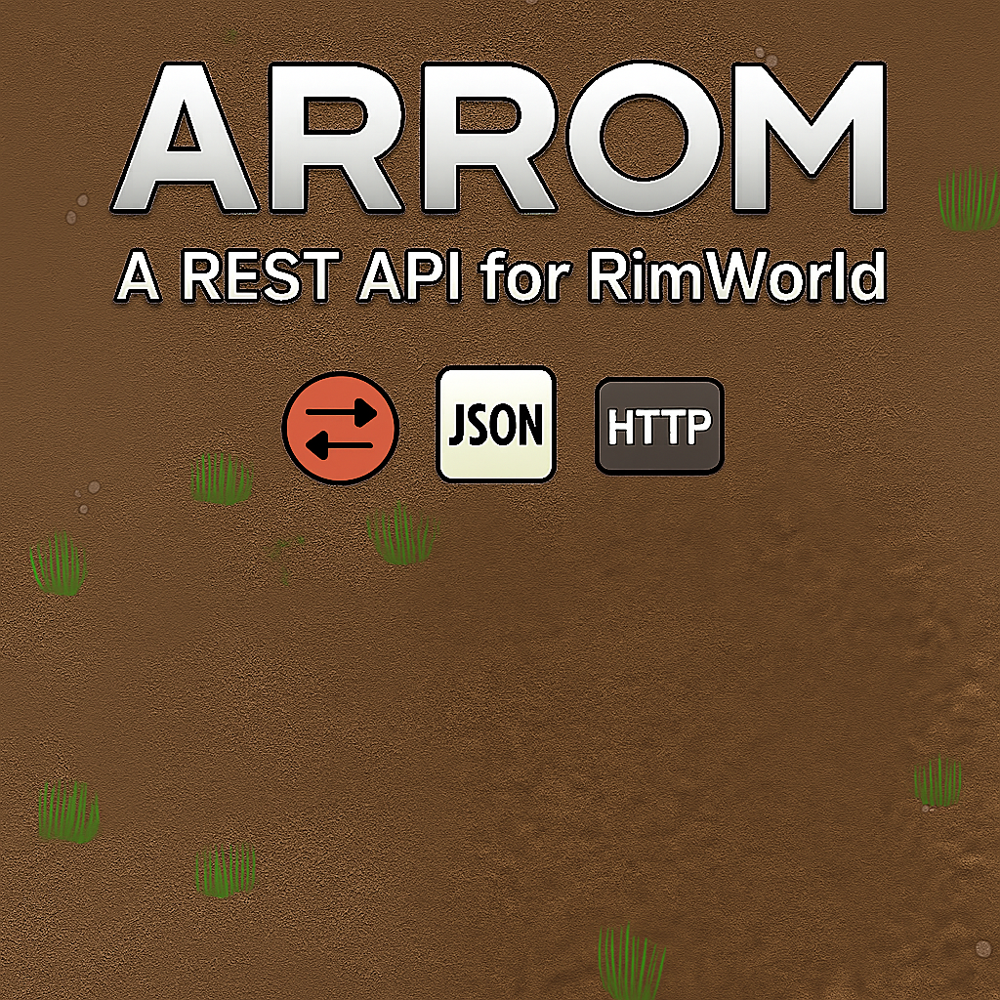

# RIMAPI
RIMAPI is a RimWorld mod that gives you an API Server to interact with your current game.

RIMAPI exposes a comprehensive REST API from inside RimWorld.
The API listens on `http://localhost:8765/` by default once the
game reaches the main menu. The port can be changed in the mod settings.

[  API Documentation  ](https://github.com/IlyaChichkov/RIMAPI/blob/main/Docs/API.md)|
[  For developers  ](https://github.com/IlyaChichkov/RIMAPI/blob/main/Docs/DEVELOPER.md)

## 🚀 Features

### Monitor current game state
- **Real-time colony status** - Get current game time, weather, storyteller, and difficulty
- **Colonist management** - Track health, mood, skills, inventory, and work priorities
- **Resource tracking** - Monitor food, medicine, materials, and storage utilization
- **Research progress** - Check current projects and completed research
- **Quests & incidents** - Get list of quests and incidents

### Game world manipulation

- **Camera Controls** - Set position, zoom, stream output
- **Interface Controls** - Select objects, open tabs
- **In development**</br>
  *item spawning, event triggering, zone management*

### Performance optimizations
- **Caching** - Efficient data updates without game lag
- **Field filtering** - Request only the data you need
- **ETag support** - Intelligent caching with 304 Not Modified responses
- **Non-blocking operations** - Game non-blocking API operations

## 🔍 Integrations

Share your projects - send integrations to be featured here

| Name | Link |
|---   |---   |
|Rimworld Dashboard | https://github.com/IlyaChichkov/rimapi-dashboard |
|Food Analysis Script (Python) | https://gist.github.com/IlyaChichkov/1c4455c9f797a277693ee5a3e016ac3d |

## 🛠️ Usage
1. Start RimWorld with the mod enabled. When the main menu loads the API server will begin listening.
2. The default address is `http://localhost:8765/`. You can change the port from the RIMAPI mod settings.
3. Use any HTTP client (curl, Postman, etc.) to call the endpoints.

### 🎯 Example
**Request:**
```bash
curl http://localhost:8765/api/v1/colonists
```

**Response:**
```json
{
  "id": 555,
  "name": "Scott",
  "gender": "Male",
  "age": 21,
  "health": 1.0,
  "mood": 0.63,
  "position": {
    "x": 95,
    "y": 0,
    "z": 80
  }
}
```

> Note: This mod is under active development. API endpoints may change between versions.

## 📄 License
This project is licensed under the MIT License - see the [LICENSE](https://github.com/IlyaChichkov/RIMAPI/blob/main/LICENSE) file for details.

## 👥 Credits and Acknowledgments

Thanks to MasterPNJ and his project for insipiration: [ARROM](https://github.com/MasterPNJ/API-REST-RimwOrld-Mod)

## 📋 Changelog

[CHANGELOG](https://github.com/IlyaChichkov/RIMAPI/blob/main/CHANGELOG)

## 🤝 Contributing

Contributions are welcome! Please feel free to submit pull requests or open issues for bugs and feature requests.
