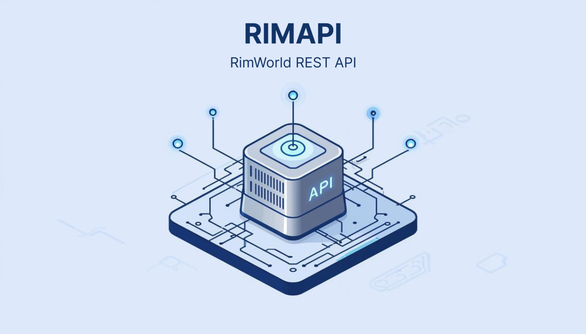

# RIMAPI
RIMAPI is a Rimworld mod that give you an API Server to interact with your current game.

RIMAPI exposes a small REST API from inside RimWorld. The API listens on `http://localhost:8765/` by default once the
game reaches the main menu. The port can be changed in the mod settings.

## Usage
1. Start RimWorld with the mod enabled. When the main menu loads the API server will begin listening.
2. The default address is `http://localhost:8765/`. You can change the port from the RIMAPI mod settings.
3. Use any HTTP client (curl, Postman, etc.) to call the endpoints.

