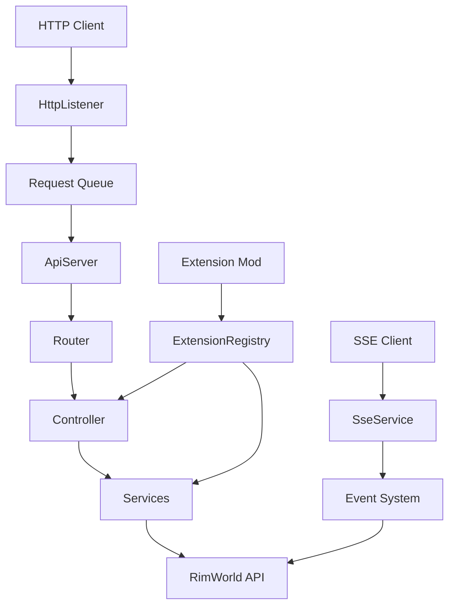
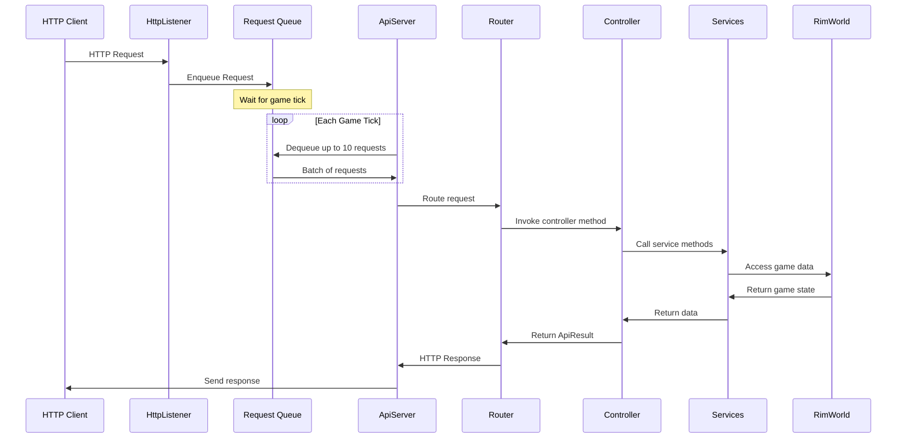
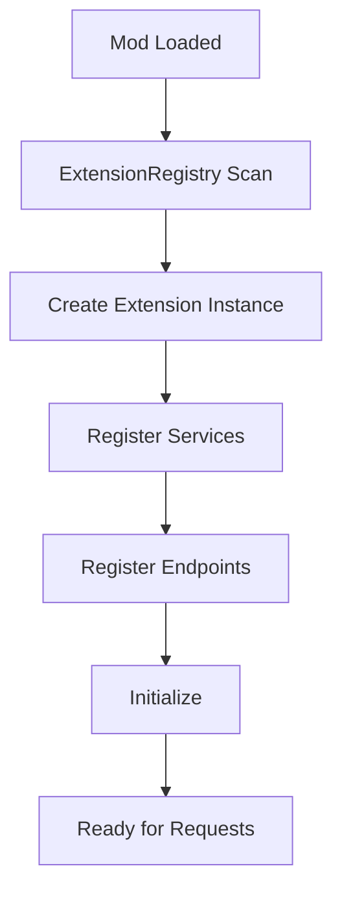

# RIMAPI Architecture Guide

This document provides a comprehensive overview of RIMAPI's architecture, designed to help mod developers understand how the system works and how to extend it effectively.

## Core Architecture Principles

RIMAPI is built around several key principles that guide its design:

- **Main Thread Safety**: All HTTP processing happens on RimWorld's main thread via queuing to prevent game instability
- **Extensibility First**: The core is designed to be extended by other mods through a well-defined extension system
- **Modularity**: Components are separated by concern and communicate through interfaces
- **Error Isolation**: One broken extension should not affect the core API or other extensions

## System Overview

## Core Components

### ApiServer

The central orchestrator that manages the HTTP server and request processing lifecycle.

- **Responsibilities**: HTTP listener management, request queue processing, lifecycle management
- **Threading**: Uses async/await for I/O but processes requests on main thread during ticks
- **Configuration**: Port binding, request throttling (10 requests/tick), CORS handling

### Dependency Injection Container

A custom-built DI system that manages service lifetimes and dependencies.

- **ServiceCollection**: Registers services with singleton/transient lifetimes
- **ServiceProvider**: Resolves dependencies with constructor injection
- **Lifetimes**:
  - **Singleton**: One instance for the entire application (e.g., ApiServer, SseService)
  - **Transient**: New instance for each resolution (e.g., most controllers)

### Router

Handles HTTP request routing to appropriate controller methods.

- **Attribute-Based**: Uses [Get], [Post], [Put], [Delete] attributes for route discovery
- **Auto-Registration**: Automatically scans for and registers controller routes
- **Pattern Matching**: Supports route parameters and pattern matching
- **Extension Namespacing**: Prevents route conflicts between mods

### SseService

Manages Server-Sent Events for real-time game updates.

- **Connection Management**: Tracks active SSE connections
- **Event Broadcasting**: Publishes game events to all connected clients
- **Heartbeat**: Regular keep-alive messages to maintain connections
- **Extension Support**: Other mods can publish custom events

## Request Lifecycle

## Extension System Architecture

The extension system allows other mods to seamlessly integrate with RIMAPI.

### IRimApiExtension Interface

    public interface IRimApiExtension
    {
        string Name { get; }
        string Version { get; }
        void RegisterServices(IServiceCollection services);
        void RegisterEndpoints(IEndpointRouteBuilder routeBuilder);
        void Initialize(IServiceProvider serviceProvider);
    }

### Extension Discovery

- **Reflection Scanning**: Automatically discovers types implementing IRimApiExtension
- **Isolated Registration**: Each extension registers its own services and routes
- **Error Handling**: Failures in one extension don't affect others

### Extension Lifetime

## Service Layer Architecture

The service layer abstracts RimWorld's internal API and provides clean, testable interfaces.

### Current Service Structure

!!! Internal
    - **ISseService**: Real-time event management
    - **IExtensionRegistry**: Extension discovery and management
    - **IDocumentationService**: API documentation generation

!!! Game
    - **IGameStateService**: Core game information (mode, storyteller, difficulty)
    - **IColonistService**: Pawn/colonist management and status
    - **IMapService**: Map information, terrain, and objects
    - **IResourceService**: Items, inventory, and resource management
    - **IResearchService**: Research progress and technology
    - **IIncidentService**: Events, quests, and incidents

## Data Flow Patterns

### REST API Flow

    HTTP Request → Router → Controller → Service → RimWorld API → DTO → JSON Response

### SSE Event Flow

    Game Hook → Event Aggregator → SseService → SSE Client
    Extension Event → Event Aggregator → SseService → SSE Client

### Extension Integration Flow

    Extension Mod → IRimApiExtension → ServiceCollection → Router → Available in API

## Error Handling Strategy

- **Global Exception Handling**: All exceptions are caught and converted to standardized error responses
- **Extension Isolation**: Try-catch blocks around extension method invocations
- **Request Timeout Protection**: Maximum processing time per request to prevent hangs
- **Circuit Breaker Pattern**: Extensions that repeatedly fail may be temporarily disabled

## Performance Considerations

!!! Abstract "In Development"
    - **Request Throttling**: Limits processing to 10 requests per game tick
    - **Lazy Initialization**: Heavy resources are initialized on first use
    - **DTO Optimization**: Data transfer objects minimize serialization overhead
    - **SSE Batching**: Multiple events may be batched in single messages
    - **Connection Pooling**: Efficient management of SSE connections

## Modding Integration Points

Extensions can integrate at multiple levels:

- **Service Layer**: Add new business logic services via DI
- **Controller Layer**: Add new REST endpoints with auto-routing
- **Event Layer**: Publish custom SSE events

## Next Steps

- Learn how to [create your first extension](../developer_guide/creating_extensions.md)
- Learn how to [add new endpoints](../contributors_guide/creating_endpoints.md)
- Check the [auto-generated API reference](../api.md)
