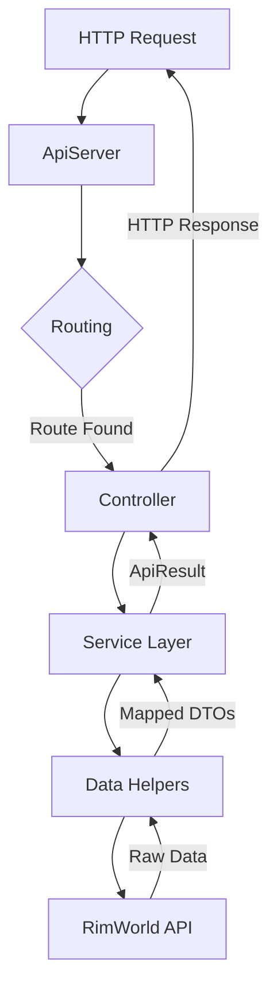

# Creating Endpoints

This guide covers how to create REST API endpoints in RIMAPI. You'll learn the patterns for building new endpoints, from the controller to the service layer.

## Architecture Overview

RIMAPI uses a layered architecture for handling HTTP requests. Understanding this flow is key to contributing effectively.



1.  **ApiServer**: The lightweight HTTP server listens for incoming requests.
2.  **Routing**: The server matches the request's path and HTTP method to a controller action decorated with `[Get("/path")]` or `[Post("/path")]` attributes.
3.  **Controller**: The controller action is the entry point for your endpoint. It parses request parameters, calls the appropriate service, and returns a JSON response.
4.  **Service Layer**: This layer contains the core business logic. It coordinates data retrieval and manipulation, often by calling one or more data helpers.
5.  **Data Helpers**: Helpers encapsulate direct interactions with the RimWorld API (`Verse` and `RimWorld` namespaces), retrieving raw game data.
6.  **DTO Mapping**: Helpers or services are responsible for mapping the raw game data into Data Transfer Objects (DTOs). This ensures a clean separation between the game's internal data structures and the API's public contract.
7.  **ApiResult**: The service layer wraps the DTO in a standardized `ApiResult<T>` object, which includes status information (`success`, `errors`, `warnings`).
8.  **HTTP Response**: The controller serializes the `ApiResult` into a JSON string and sends it back to the client.

## Step-by-Step: Creating a New Endpoint

Let's create a new `GET /api/v1/example` endpoint.

### 1. Define the DTO

First, define the Data Transfer Object (DTO) that will represent the data your endpoint returns. Create a new class in an appropriate file under `Source/RIMAPI/RimworldRestApi/Models/`.

**`Source/RIMAPI/RimworldRestApi/Models/ExampleDto.cs`**
```csharp
namespace RIMAPI.Models
{
    public class ExampleDto
    {
        public string Message { get; set; }
        public bool IsExample { get; set; }
    }
}
```

### 2. Create the Service Interface

Define the contract for your service in the `Source/RIMAPI/RimworldRestApi/Services/` directory.

**`Source/RIMAPI/RimworldRestApi/Services/IExampleService.cs`**
```csharp
using RIMAPI.Core;
using RIMAPI.Models;

namespace RIMAPI.Services
{
    public interface IExampleService
    {
        ApiResult<ExampleDto> GetExampleMessage();
    }
}
```

### 3. Implement the Service

Create the concrete implementation of the service. This is where your business logic lives.

**`Source/RIMAPI/RimworldRestApi/Services/ExampleService.cs`**
```csharp
using RIMAPI.Core;
using RIMAPI.Models;

namespace RIMAPI.Services
{
    public class ExampleService : IExampleService
    {
        public ApiResult<ExampleDto> GetExampleMessage()
        {
            // In a real scenario, you would call a helper to get RimWorld data.
            var exampleData = new ExampleDto
            {
                Message = "This is a test from the service layer!",
                IsExample = true
            };
            
            return ApiResult<ExampleDto>.Ok(exampleData);
        }
    }
}
```

### 4. Create the Controller

Create a controller to expose the service logic as an HTTP endpoint. Place it in `Source/RIMAPI/RimworldRestApi/BaseControllers/`.

**`Source/RIMAPI/RimworldRestApi/BaseControllers/ExampleController.cs`**
```csharp
using System.Net;
using System.Threading.Tasks;
using RIMAPI.Core;
using RIMAPI.Http;
using RIMAPI.Services;

namespace RIMAPI.Controllers
{
    public class ExampleController : BaseController
    {
        private readonly IExampleService _exampleService;

        public ExampleController(IExampleService exampleService)
        {
            _exampleService = exampleService;
        }

        [Get("/api/v1/example")]
        [EndpointMetadata("An example endpoint to demonstrate functionality.")]
        public async Task GetExample(HttpListenerContext context)
        {
            var result = _exampleService.GetExampleMessage();
            await context.SendJsonResponse(result);
        }
    }
}
```

### 5. Register Service for Dependency Injection

For the `ExampleController` to receive an instance of `IExampleService`, you must register it in the dependency injection container.

Open `Source/RIMAPI/RIMAPI_Mod.cs` and add your service to the `ConfigureServices` method:

```csharp
private void ConfigureServices(IServiceCollection services)
{
    // ... other services
    services.AddSingleton<IExampleService, ExampleService>();
    // ... other services
}
```

### 6. Document the Endpoint

Finally, add an entry for your new endpoint in `docs/_endpoints_examples/examples.yml`. This makes it visible in the API documentation.

```yaml
    "/api/v1/example":
        desc: |
            An example endpoint that returns a sample message.
        curl: |
            **Example:**
            ```bash
            curl --request GET \
            --url 'http://localhost:8765/api/v1/example'
            ```
        request: ""
        response: |
            **Response:**
            ```json
            {
                "success": true,
                "data": {
                    "Message": "This is a test from the service layer!",
                    "IsExample": true
                },
                "errors": [],
                "warnings": [],
                "timestamp": "2025-12-12T12:00:00.0000000Z"
            }
            ```
```

## Advanced Topics

### Handling Request Data

#### Query Parameters

Use `RequestParser` to safely extract parameters from the URL.

```csharp
[Get("/api/v1/colonist")]
public async Task GetColonist(HttpListenerContext context)
{
    var pawnId = RequestParser.GetIntParameter(context, "id");
    var result = _colonistService.GetColonist(pawnId);
    await context.SendJsonResponse(result);
}
```

#### JSON Body in POST Requests

For `[Post]` endpoints, you can read the request body and deserialize it into a DTO.

```csharp
[Post("/api/v1/colonist/work-priority")]
public async Task SetColonistWorkPriority(HttpListenerContext context)
{
    var body = await context.Request.ReadBodyAsync<WorkPriorityRequestDto>();
    var result = _colonistService.SetColonistWorkPriority(body);
    await context.SendJsonResponse(result);
}
```

### Caching Responses

For data that doesn't change frequently, use the `ICachingService` to improve performance.

```csharp
[Get("/api/v1/colonists")]
public async Task GetColonists(HttpListenerContext context)
{
    await _cachingService.CacheAwareResponseAsync(
        context,
        key: "/api/v1/colonists",
        dataFactory: () => Task.FromResult(_colonistService.GetColonists()),
        expiration: TimeSpan.FromSeconds(30)
    );
}
```

## Testing Your Endpoints

Once you've built your endpoint, you can test it using tools like [Hoppscotch](https://hoppscotch.io/), [Postman](https://www.postman.com/), or `curl`.

```bash
# Example with a query parameter
curl "http://localhost:8765/api/v1/colonist?id=1020"

# Example with a POST request and JSON body
curl --request POST \
  --url http://localhost:8765/api/v1/colonist/work-priority \
  --header 'Content-Type: application/json' \
  --data '{ 
    "id": 1020, 
    "work": "Cooking", 
    "priority": 1 
  }'
```

## Next Steps
- Explore the existing controllers and services to see more examples.
- Check the [auto-generated API reference](../api.md) for existing endpoints.