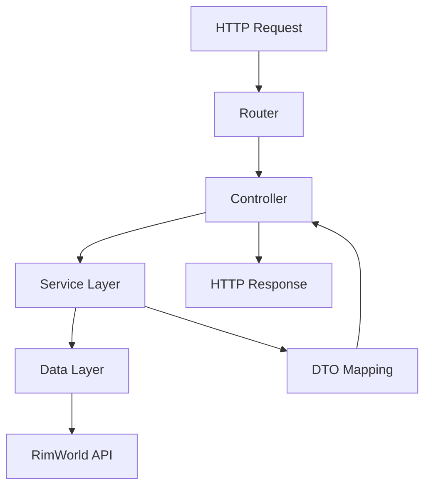

# Creating Endpoints

This guide covers how to create REST API endpoints in RIMAPI, both in the core system and through extensions. You'll learn the patterns, best practices, and common pitfalls for building effective API endpoints.

## Endpoint Architecture Overview

RIMAPI uses a layered architecture for handling HTTP requests:



## Core Endpoint Creation

### Example Controller Structure

```csharp
    [ApiController]
    [Route("api/[controller]")]
    public class ExampleController
    {
        private readonly IExampleService _exampleService;

        public ExampleController(IExampleService exampleService)
        {
            _exampleService = exampleService;
        }

        [Get("/api/v1/example")]
        public ApiResult<List<ExampleDto>> GetAll()
        {
            var examples = _exampleService.GetAllExamples();
            return ApiResult.Success(examples);
        }
    }
```

### HTTP Method Attributes

Use the appropriate HTTP method attributes for your endpoints:

```csharp
    [Get("")]    // Retrieve resources
    [Put("")]    // Update entire resource
    [Post("")]   // Create new resource
    [Delete("")] // Delete resource
```

For extension endpoint creation see [creating_extensions](creating_extensions.md)

## Response Patterns

### Standardized ApiResult

Always use `ApiResult<T>` for consistent responses:

```csharp
    // Success responses
    return ApiResult.Ok(data);
    return ApiResult.Ok("Operation completed");
    return ApiResult.Ok(); // For void operations

    // Error responses
    return ApiResult.Fail("Error message");
    return ApiResult.Partial("Warnings message");
    return ApiResult.Unimplemented();
```

### Response Examples

```csharp
    // Success with data
    {
      "success": true,
      "data": {
        "id": "colonist_123",
        "name": "John",
        "profession": "Doctor"
      },
      "error": null
    }

    // Error response
    {
      "success": false,
      "data": null,
      "error": "Colonist not found"
    }
```

## Data Transfer Objects (DTOs)

### Why Use DTOs?

- Prevent exposing RimWorld internal types
- Control exactly what data is serialized
- Versioning and backward compatibility

### DTO Patterns

```csharp
    // Response DTO
    public class ColonistDto
    {
        public string Id { get; set; }
        public string Name { get; set; }
        public int Health { get; set; }
    }
```

### Response Caching

```csharp
    [HttpGet("static-data")]
    [ResponseCache(Duration = 300)] // Cache for 5 minutes
    public ApiResult<StaticDataDto> GetStaticData()
    {
        var data = _staticDataService.GetData();
        return ApiResult.Success(data);
    }
```

## Testing Your Endpoints

### Manual Testing with curl

#### Tools:

[Hoppscotch](https://hoppscotch.io/)

[Postman](https://www.postman.com/)

**Curl:**

```bash
    curl http://localhost:8765/api/v1/new_endpoint
```

## Next Steps

- Check the [auto-generated API reference](../api.md) for existing endpoints
