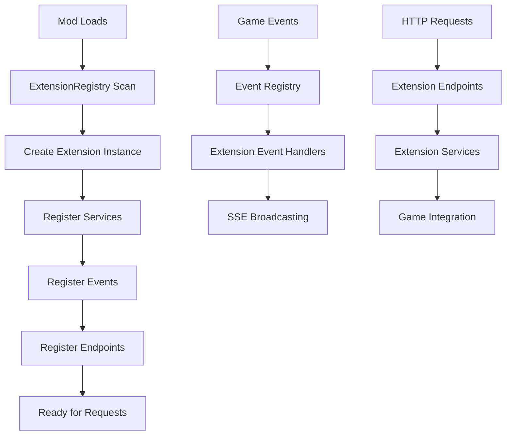

# Creating Extensions

This guide covers how to create RIMAPI extensions to add custom functionality, endpoints, and events to the API. Extensions allow other mods to seamlessly integrate with RIMAPI without modifying the core system.

## Extension Architecture Overview

Extensions are discovered automatically by RIMAPI and integrated into the API lifecycle:



## Basic Extension Structure

### Core Interface

All extensions must implement `IRimApiExtension`:

```csharp
    public interface IRimApiExtension
    {
        string ExtensionId { get; }
        string ExtensionName { get; }
        string Version { get; }
        
        void RegisterServices(IServiceCollection services);
        void RegisterEvents(IEventRegistry eventRegistry);
        void RegisterEndpoints(IExtensionRouter router);
    }
```

### Minimal Extension Example

TBE

## Extension Discovery

RIMAPI automatically discovers extensions by scanning all loaded assemblies for types implementing `IRimApiExtension`. The discovery process:

- Runs automatically when RIMAPI initializes
- Scans all loaded RimWorld mod assemblies
- Creates instances of found extensions
- Isolates errors - one broken extension won't affect others
- Logs all discovered extensions for debugging

## Service Registration

### Dependency Injection in Extensions

Extensions can register their own services using RIMAPI's DI container:

```csharp
    public void RegisterServices(IServiceCollection services)
    {
        // Singleton - one instance for entire application
        services.AddSingleton<IMyConfigService, MyConfigService>();
        
        // Transient - new instance for each resolution
        services.AddTransient<IMyExampleController, IMyExampleController>();
    }
```

### Service Lifetime Guidelines

| Lifetime | Use Case | Example |
| --- | --- | --- |
| **Singleton** | Configuration, shared state, event publishers | `MyConfigService`, `EventAggregator` |
| **Transient** | Business logic, stateless services, request handlers | `DataProcessor`, `ValidationService` |

### Accessing RIMAPI Core Services

Extensions can consume core RIMAPI services through dependency injection:

```csharp
    public class MyService : IMyService
    {
        private readonly ISseService _sseService;
        private readonly IGameStateService _gameState;

        public MyService(ISseService sseService, IGameStateService gameState)
        {
            _sseService = sseService;
            _gameState = gameState;
        }

        public void DoSomething()
        {
            // Use core RIMAPI services
            var gameMode = _gameState.GetGameMode();
            _sseService.PublishEvent("my-extension.action-completed", new { result = "success" });
        }
    }
```

## Event System Integration

### Registering Custom Events

Extensions can define and publish their own SSE events:

```csharp
    public void RegisterEvents(IEventRegistry eventRegistry)
    {
        // Register custom events
        eventRegistry.RegisterEvent("my-extension.item-crafted");
        eventRegistry.RegisterEvent("my-extension.quest-completed");
        eventRegistry.RegisterEvent("my-extension.error-occurred");
    }
```

### Publishing Events

Use the `IEventPublisher` to broadcast events to SSE clients:

```csharp
    public class MyCraftingService
    {
        private readonly IEventPublisher _eventPublisher;

        public MyCraftingService(IEventPublisher eventPublisher)
        {
            _eventPublisher = eventPublisher;
        }

        public void OnItemCrafted(Thing item, Pawn crafter)
        {
            _eventPublisher.Publish("my-extension.item-crafted", new
            {
                itemId = item.ThingID,
                itemName = item.Label,
                crafterName = crafter.Name.ToString(),
                crafterId = crafter.Id.ToString(),
                timestamp = DateTime.UtcNow
            });
        }
    }
```

### Listening to Game Events

Extensions can hook into RimWorld events and publish them as SSE events:

```csharp
    public class MyGameEventService
    {
        private readonly IEventPublisher _eventPublisher;

        public MyGameEventService(IEventPublisher eventPublisher)
        {
            _eventPublisher = eventPublisher;
        }

        public void Initialize()
        {
            // Hook into RimWorld events
            Find.TickManager.TickManagerTick += OnGameTick;
            Find.Storyteller.incidentQueue.IncidentQueueTick += OnIncidentQueued;
        }

        private void OnGameTick()
        {
            // Publish periodic events
            if (Find.TickManager.TicksGame % 60 == 0) // Every 60 ticks
            {
                _eventPublisher.Publish("my-extension.game-tick", new
                {
                    tick = Find.TickManager.TicksGame,
                    time = DateTime.UtcNow
                });
            }
        }
    }
```

## Endpoint Registration

TBE

### Controller-Based Endpoints

For complex APIs, use controller classes with auto-routing:

```csharp
    // Controller will be automatically discovered and routed
    public class ItemsController
    {
        private readonly IItemsService _itemsService;

        public ItemsController(IItemsService itemsService)
        {
            _itemsService = itemsService;
        }

        [Get("/item")]
        public ApiResult<ItemDto> GetByItemId(string id)
        {
            var item = _itemsService.GetItem(id);
            if (item == null)
                return ApiResult.NotFound($"Item {id} not found");
                
            return ApiResult.Success(item);
        }
    }
```

### Endpoint Namespacing

All extension endpoints are automatically namespaced to prevent conflicts:

???+ warning
    Your extension registers: `/items`

    Becomes available at: `/api/extensions/your-extension-id/items`

    Example URLs:

    **GET** `/api/extensions/my-crafting-mod/items`

    **POST** `/api/extensions/my-crafting-mod/items`

    **GET** `/api/extensions/my-crafting-mod/items/123`

## Complete Example: Crafting Extension

### Extension Definition

```csharp
    public class CraftingExtension : IRimApiExtension
    {
        public string ExtensionId => "crafting-mod";
        public string ExtensionName => "Advanced Crafting API";
        public string Version => "1.0.0";

        public void RegisterServices(IServiceCollection services)
        {
            services.AddSingleton<ICraftingService, CraftingService>();
            services.AddSingleton<ICraftingEventService, CraftingEventService>();
            services.AddTransient<IRecipeService, RecipeService>();
        }

        public void RegisterEvents(IEventRegistry eventRegistry)
        {
            eventRegistry.RegisterEvent("crafting.recipe-started");
            eventRegistry.RegisterEvent("crafting.recipe-completed");
            eventRegistry.RegisterEvent("crafting.recipe-failed");
            eventRegistry.RegisterEvent("crafting.materials-low");
        }

        public void RegisterEndpoints(IExtensionRouter router)
        {
            // Manual endpoint registration
            router.MapGet("/recipes", () => GetRecipes());
            router.MapPost("/recipes/{defName}/craft", (string defName) => StartCrafting(defName));
            
            // Controller-based endpoints will be auto-discovered
        }
    }
```

### Supporting Services

```csharp
    public class CraftingService : ICraftingService
    {
        private readonly IEventPublisher _eventPublisher;
        private readonly IGameStateService _gameState;

        public CraftingService(IEventPublisher eventPublisher, IGameStateService gameState)
        {
            _eventPublisher = eventPublisher;
            _gameState = gameState;
        }

        public bool StartCrafting(string recipeDefName, string colonistId = null)
        {
            try
            {
                // Implementation logic here
                _eventPublisher.Publish("crafting.recipe-started", new
                {
                    recipe = recipeDefName,
                    colonist = colonistId,
                    timestamp = DateTime.UtcNow
                });
                
                return true;
            }
            catch (Exception ex)
            {
                _eventPublisher.Publish("crafting.recipe-failed", new
                {
                    recipe = recipeDefName,
                    error = ex.Message,
                    timestamp = DateTime.UtcNow
                });
                
                return false;
            }
        }
    }
```

## Error Handling and Isolation

### Extension Error Isolation

RIMAPI provides error isolation to prevent one broken extension from affecting others:

- Exceptions in extension initialization are caught and logged
- Failed service registration doesn't affect other extensions
- Endpoint errors return proper HTTP status codes
- Event publishing failures are logged but don't crash the system

### Proper Error Handling in Extensions

```csharp
    public class RobustCraftingService
    {
        public ApiResult<CraftingResult> StartCrafting(string recipeDefName)
        {
            try
            {
                if (string.IsNullOrEmpty(recipeDefName))
                    return ApiResult.BadRequest("Recipe definition name is required");
                    
                var recipeDef = DefDatabase<RecipeDef>.GetNamed(recipeDefName, false);
                if (recipeDef == null)
                    return ApiResult.NotFound($"Recipe {recipeDefName} not found");
                    
                // Business logic here
                return ApiResult.Success(new CraftingResult { Success = true });
            }
            catch (Exception ex)
            {
                LogApi.Error($"Crafting failed for {recipeDefName}: {ex}");
                return ApiResult.Error($"Crafting failed: {ex.Message}");
            }
        }
    }
```

## Testing Your Extension

### Development Testing Checklist

- [x] Extension is discovered and registered by RIMAPI
- [x] Services are properly registered and resolvable
- [x] Events are registered and can be published
- [x] Endpoints respond correctly to HTTP requests
- [x] Error handling works as expected
- [x] No performance impact on the game
- [x] Works alongside other popular mods

### Versioning

```csharp
    public string Version => "1.2.3"; // Major.Minor.Patch

    // Update version when:
    // - Major: Breaking changes to API
    // - Minor: New features, backward compatible
    // - Patch: Bug fixes, no API changes
```

## Next Steps

- Explore [practical extension examples](examples/simple_extension.md)
- Learn about [creating advanced endpoints](creating_endpoints.md)
- Review [extension development best practices](best_practices.md)
- Check the [auto-generated API reference](../api.md) for available core services
